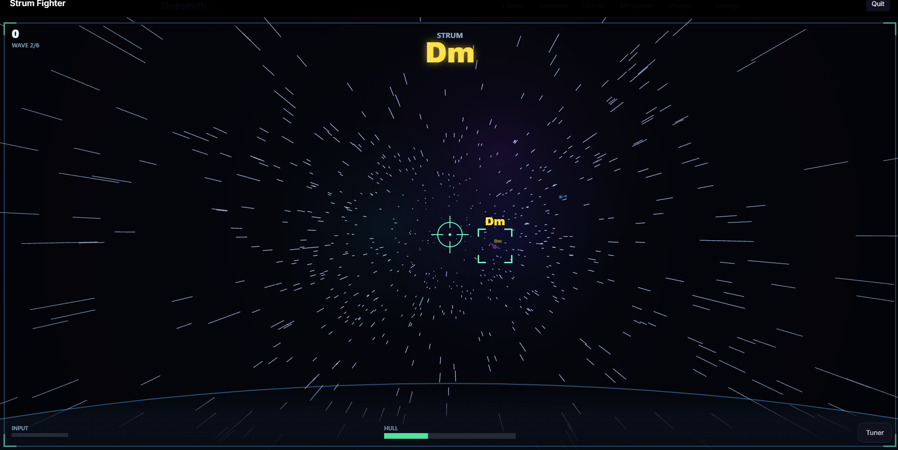

# Strum Fighter

A first-person cockpit **chord-shooter** minigame for [Slopsmith](https://github.com/slopsmith/slopsmith).

You fly through a space battle. Each enemy fighter has a **chord name** painted on it by
the HUD, and your reticle auto-locks the nearest one. **Strum that chord on your guitar to
destroy it** — a correct strum detonates the fighter, a wrong chord fires but misses. Clear
the waves before the enemies breach your hull.

Every few waves — and always the last — a **boss gunship** warps in, armoured by a **chord
progression**. Strum the highlighted chord to peel a shield plate and advance to the next;
peel them all to crack the core. Its shields show as a segmented bar in the HUD and as pips
painted on the ship, so you can watch its health fall as you fight.

It's a great way to drill chord recognition and clean chord changes under pressure, with no
song or chart required.

## Requirements

- **Slopsmith desktop app** with your guitar plugged in and an input device selected.
  Chord detection runs chart-free on the native audio engine
  (`window.slopsmithDesktop.audio.scoreChord`), which only exists in the desktop build. In a
  browser-only Slopsmith the game shows a "needs the desktop app" panel instead of running.
- The **Minigames** plugin (provides the hub + SDK). Strum Fighter registers itself with it.

No `note_detect` dependency — chord scoring is independent of the note-detection plugin.

## How to play

1. Open **Minigames** → **Strum Fighter**.
2. Pick a difficulty, wave count, and music.
3. Strum the chord shown on the locked (highlighted) fighter. Build a combo with consecutive
   hits; a wrong chord or a fighter reaching your cockpit breaks the combo and damages the hull.

## Modifiers

- **Difficulty** — `easy` / `medium` / `hard`. Sets the chord pool (open → +barre → +7ths),
  the detection leniency, enemy speed/spawn rate, and boss aggression + escort count.
- **Waves** — `short` (3) / `normal` (6) / `long` (10). A boss appears every 3rd wave and on
  the final wave.
- **Livery** — `auto` / `default` / `ace` / `squad`. Re-themes the cockpit (HUD accent, tracer
  colour, fill light). `auto` uses your highest unlocked livery. **Ace** unlocks at 250 XP and
  **Squadron** at 1000 XP (total Minigames profile XP); picking a livery you haven't unlocked
  gracefully falls back to your best one.
- **Chord labels** — `on` (default) / `fade` / `off`. `on` is the casual game (letter
  always shown). `fade` shows the letter at spawn and fades it as the fighter closes — the
  ear-training on-ramp. `off` hides the letters entirely (pure ear-only; auto-enables the
  enemy chord sound so you have something to go on). In fade/off, the chord name flashes at
  the explosion when you destroy a target, so you learn whether your ear was right.
- **Enemy chord sound** — `off` (default) / `on`. When on, the locked enemy "strums" its
  chord (panned by position, louder when nearer) so you can hear your target. Independent of
  the Music toggle. Clean on a direct guitar input; on a mic, loud monitoring could bleed
  into detection.
- **Music** — backing groove on/off (boss waves switch to a heavier, faster groove).

## Architecture

A standard Slopsmith minigame: a `minigame` block in `plugin.json` + a JS spec registered
with `window.slopsmithMinigames`. Entry point `game.js` loads Three.js (vendored in core at
`/static/vendor/three/`) and the ES modules under `assets/modules/`, then runs the game loop.

| Module | Responsibility |
|---|---|
| `chords.js` | Chord dictionary (name → frets → notes) + difficulty tiers + boss progressions |
| `skins.js` | XP-gated cockpit liveries + unlock resolution from the profile |
| `audio-input.js` | Strum-onset detection (`getLevels`) + chord scoring (`scoreChord`) |
| `scene.js` | Three.js scene, camera, renderer, starfield, planet, lighting, livery tint |
| `enemies.js` | Enemy fighters, boss gunship, billboarded chord/progression labels |
| `weapons.js` | Tracers, muzzle flash, explosions, boss shield-peel + core FX |
| `hud.js` | 2D cockpit HUD (reticle, locked chord, hull, combo, boss shield bar, banners) |
| `synth.js` | Backing groove (+ boss intensity) + laser/explosion/stinger SFX + enemy chord cue (Web Audio) |

Scoring uses `scoreChord`'s `{ isHit, score }`: a fighter kill is `100 × combo × (0.5 + 0.5·score)`,
a boss plate peel is `150 ×` the same; plus wave-clear, flawless-wave, and boss-kill bonuses.

**Liveries** read `sdk.getProfile().unlocks` (game-scoped IDs like `strum_fighter:skin_ace`,
gated on total profile XP) and re-theme the HUD/tracers/lighting. The Livery modifier picks one;
`auto` resolves to the highest unlocked.

## Roadmap

- **Phase 1 (0.1.x):** playable vertical slice — cockpit, starfield, fighters with chord
  labels, locked-reticle strum→score→hit/miss, waves, hull, combo, score + summary.
- **Phase 2/3 (0.2.0, this build):** richer ships + planet/nebula backdrop, boss gunships
  armoured by chord progressions with visible shields, XP-gated liveries, deeper scoring +
  bonuses, more HUD feedback, and boss-intensity audio.
- **0.3.0 (ear-training):** enemies can voice their chord (Karplus-Strong, panned),
  chord-label fade/off modes, and a post-kill chord reveal — opt-in practice for your ear,
  with the casual default unchanged.
- **Next:** glTF ship models + textures, a fuller soundtrack, more boss progressions and
  attack patterns, and additional unlock liveries.

## License

**AGPL-3.0-only**, matching the core Slopsmith and Slopsmith Desktop repositories.
See [LICENSE](LICENSE). Contributions require a DCO sign-off (`git commit -s`).
